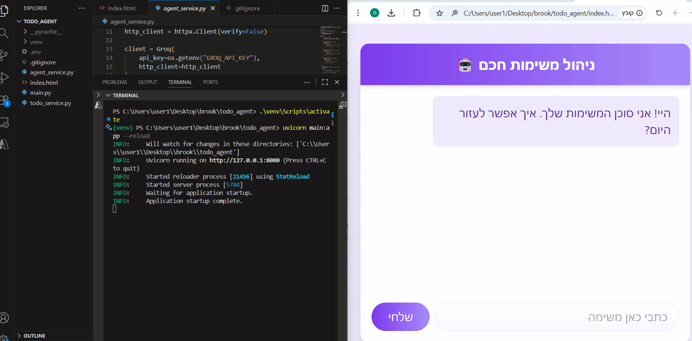
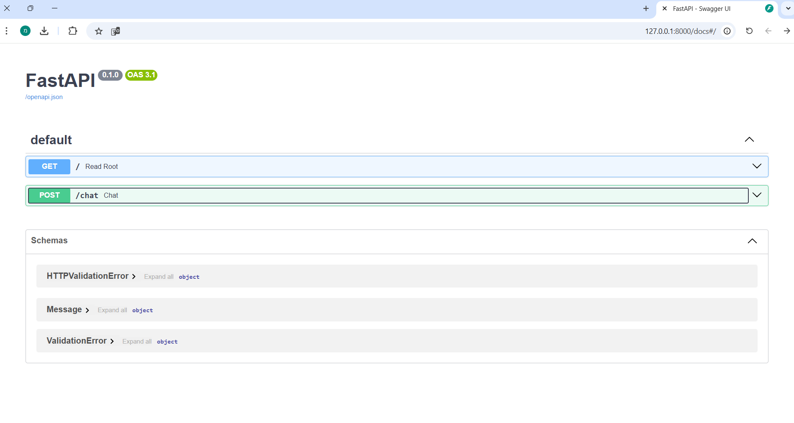

# Intelligent To-Do AI Agent 
### *A Full-Stack Autonomous Task Management System Powered by LLMs*

This project demonstrates a high-level implementation of an **AI Agent** capable of understanding natural language, making autonomous decisions, and executing CRUD (Create, Read, Update, Delete) operations on a task database. 

The system leverages a **Large Language Model (LLM)** via the Groq API, using **Function Calling** (Tool Use) to bridge the gap between unstructured conversation and structured data execution.

---

<p align="center">
  
</p>

---

##  Table of Contents
* [The Objective](#the-objective)
* [System Architecture](#system-architecture)
* [Technical Implementation](#technical-implementation)
* [Key Features](#key-features)
* [Prerequisites & Installation](#prerequisites--installation)
* [Execution](#execution)

---

##  The Objective
The core requirement was to move beyond a simple "chatbot" and build a **functional agent**. The agent is designed to:
1.  **Understand Intent:** Parse ambiguous user input (e.g., "Remind me to buy flowers for Friday").
2.  **Autonomous Tool Use:** Decide which specific function (`add_task`, `get_tasks`, etc.) to call based on the user's intent.
3.  **Data Persistence:** Maintain a stateful, reliable list of tasks.
4.  **Natural Response:** Formulate human-friendly feedback in Hebrew after performing the requested action.

---

##  System Architecture
The project follows a **Modular Multi-Tier Architecture**, ensuring separation of concerns:

1.  **Frontend (React/Tailwind):** A modern, responsive UI that handles user input and renders the agent's "thoughts" and responses.
2.  **API Layer (FastAPI):** A high-performance Python web framework serving as the secure gateway (Backend).
3.  **Agent Logic (Groq Cloud):** The reasoning engine using `llama-3.3-70b-versatile` to process logic and manage tools.
4.  **Service Layer (Business Logic):** Pure Python modules that handle data manipulation and logic execution.


---

##  Technical Implementation

### 1. The Decision Engine (Function Calling)
Unlike standard AI chats, this system uses **Function Calling**. We provide the LLM with a JSON schema defining our Python functions. The LLM analyzes the query and returns a structured JSON object specifying *which* function to call and with *what* arguments.

### 2. Deterministic Output Control
To ensure the reliability of the system, the LLM is configured with a **Temperature of 0.1**. This forces the model to be deterministic, significantly reducing "hallucinations" and ensuring that tool calls follow a strict JSON syntax.

### 3. Middleware & Connectivity
The Backend implements **CORS (Cross-Origin Resource Sharing)** middleware, allowing the React-based Frontend to communicate with the FastAPI server seamlessly. It also features custom `httpx` configurations to handle network security constraints (SSL) often found in restricted environments.

---

##  Key Features
* **Semantic Analysis:** Recognizes that "Add milk" and "Don't forget the milk" both require the `add_task` function.
* **Contextual Responses:** The agent doesn't just execute; it explains what it did in natural Hebrew.
* **Full CRUD Lifecycle:** * `get_tasks`: Real-time retrieval of the task list.
    * `add_task`: Dynamic entry creation.
    * `update_task`: State management (marking as done).
    * `delete_task`: Resource cleanup.
* **Modern UI:** Built with React hooks and Tailwind CSS for a sleek, interactive experience.

---

##  Prerequisites & Installation
 Clone the Repository
```bash
git clone https://github.com/Yaeli6858/task-manager-agent
cd todo-agent
```

### 1. Requirements
* **Python 3.10+**
* **Groq API Key**
* **Virtual Environment (venv)**

### 2. Environment Setup
Create a `.env` file in the root directory:
```env
GROQ_API_KEY=your_api_key_here
````

### 3. Install Dependencies
Ensure your virtual environment is activated, then run:
```bash
pip install -r requirements.txt
```

##  Execution

### 1. Start the Backend Server

Run the following command:

```bash
uvicorn main:app --reload
```

The API will be live at:

```
http://127.0.0.1:8000
```

---

### 2. Launch the Frontend

Open `index.html` using a local server  
(for example, the VS Code Live Server extension).

---

### 3. Example Prompts to Try

- "תוסיף לי משימה לקנות לחם וחלב"
- "איזה משימות יש לי עכשיו?"
- "תסמן את משימה 1 כבוצעה"
- "תמחק את כל מה שקשור לקניות"

---


## 🔌 API Documentation (Interactive Swagger UI)
One of the powerful features of **FastAPI** is the automatic generation of interactive API documentation. 
This allows developers to test the agent's endpoints directly from the browser.

**How to access:**
1. Start the backend server (`uvicorn main:app --reload`).
2. Navigate to: [http://127.0.0.1:8000/docs](http://127.0.0.1:8000/docs)

<p align="center">
  
</p>


##  Developer Perspective

This project serves as a robust foundation for Agentic AI development.

By decoupling:

- Reasoning (LLM)
- Execution (Python tools)

We create a scalable and extensible system.

The architecture can easily be extended with:

- Database integrations
- Calendar syncing
- Third-party API connections

This separation of concerns ensures maintainability, flexibility, and long-term scalability.
